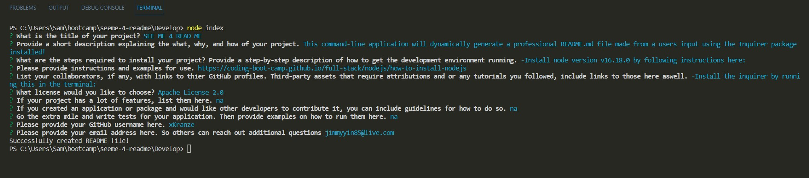

#SEE ME 4 README

## Description

This command-line application will dynamically generate a professional README.md file made from a users input using the Inquirer package installed!  

This README generated is based on the README guide found in this documentation:
https://coding-boot-camp.github.io/full-stack/github/professional-readme-guide

## Installation

Some installation packages is needed to run this application in command-line.

Please be sure to have the following installed prior to running this application:
-Install node version v16.18.0 by following instructions here:
https://coding-boot-camp.github.io/full-stack/nodejs/how-to-install-nodejs

-Install the inquirer by running this in the terminal:
npm i inquirer@8.2.4

Once these steps are completed run the index.js file to generate your personal README.md.

## Usage

Provide instructions and examples for use. Include screenshots as needed.

    
   

## Credits

https://coding-boot-camp.github.io/full-stack/nodejs/how-to-install-nodejs

https://www.npmjs.com/package/inquirer

UW BOOTCAMP COURSE

Tutors

## Features

Creates a new README.md file using user inputs.